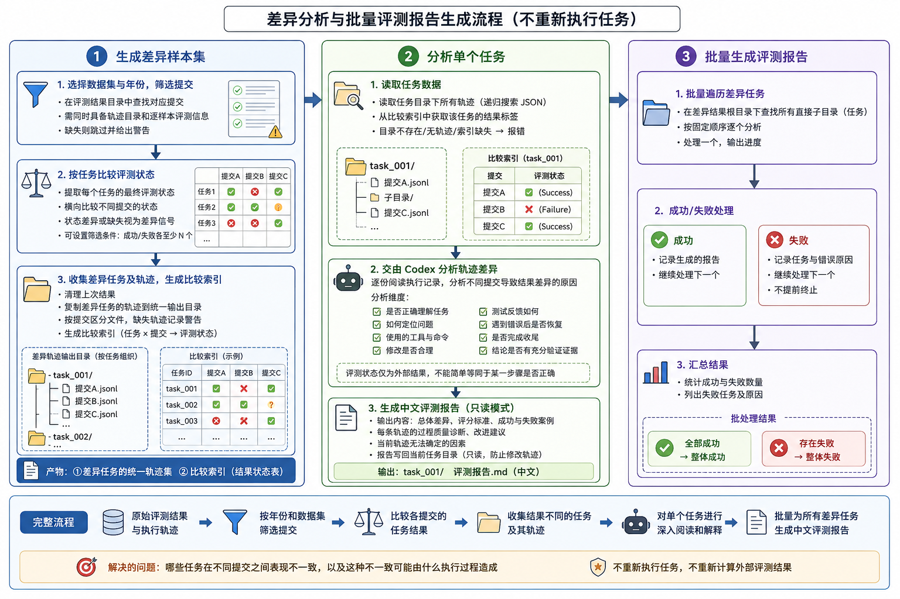

# SWE-bench 轨迹统一评分 Rubric

本文根据 `verified/` 下的差异样本、现有 `analyse.md` 和对应 ATIF 轨迹归纳。它评价的是一条轨迹是否体现了可信、可复核的软件工程过程；外部 `resolved` 结果单独记录，不直接换算成过程分。

{: width="50"}

## 1. 评分对象与基本原则

- 评分对象是最终交付的补丁及其形成过程，而不是模型名称、token、成本或步骤数。
- 评分前先建立该 issue 的验收 oracle：必须实现的行为、必须保留的旧行为、边界/反例和提交约束。
- 以最终提交物为准。中途曾经正确但后来被覆盖、回滚或没有进入 `patch.txt` 的修改，不能按最终修复计分。
- 只奖励轨迹中可观察、可复核的证据。没有证据时不臆测为正确，也不把环境失败自动归咎于补丁。
- 测试数量不等于验证质量；能区分候选方案的反例和行为断言比重复跑大套件更有价值。
- `resolved=true/false` 在评分完成后用于校准和解释不一致，不用于事前加分或扣分。

该目录的规模可作为本规范的适用背景：100 个 issue 目录、1,088 条可用 JSON 轨迹、63 份人工分析文档（覆盖 686 条轨迹）。现有分析反复显示：只通过题面最小例、只看测试数量、或只看外部标签，都会产生明显误判。

## 2. 评分前的事实记录

每条轨迹先填写事实表，再评分：

| 项目 | 要记录的事实 |
|---|---|
| 外部结果 | `resolved=true/false/unknown`；若有 grader 日志，记录测试名和断言 |
| 任务 oracle | 正向行为、负向/兼容行为、边界矩阵、禁止修改项 |
| 最终交付物 | 工作树最终状态、修改文件、最终 diff/patch 是否非空且可应用 |
| 时间线 | 初始复现、根因假设、每次实质修改、修后验证、最终检查 |
| 环境 | Python/依赖版本、导入路径、是否使用临时兼容修改、是否恢复现场 |
| 证据缺口 | 未运行的测试、截断输出、无法确认的隐藏测试或外部失败原因 |

## 3. 100 分过程评分

每一维按“优秀 / 合格 / 有限 / 缺失”评分，建议分别取该维权重的 100% / 70% / 40% / 0%。在两个档位之间可按证据比例取值。

| 维度 | 权重 | 优秀档（满分附近） | 合格档 | 有限/低档 | 主要证据与扣分信号 |
|---|---:|---|---|---|---|
| A. 任务理解与验收标准 | 15 | 准确复述失败机制、预期结果、非目标和兼容约束；给出可执行的正/反例矩阵 | 主问题理解正确，但边界或约束不全 | 只复述 traceback/PR 文字，或把“不报错”当成功 | 早期推理、复现输入输出、预期断言；没有明确成功标准、把 `resolved` 当 oracle 时扣分 |
| B. 根因定位与假设验证 | 15 | 读取实现、调用者、相关测试/历史；建立完整数据/控制/状态因果链，在责任层验证并排除替代解释 | 找到相关函数，因果链或调用面不完整 | 关键词命中后盲改、只修表象、持续坚持已被实验否定的假设 | 搜索和源码范围、调用链、最小对照实验、对象/状态/SQL/HTML 等直接证据 |
| C. 实现正确性、泛化与范围 | 25 | 修复责任层的真实数据流；覆盖主场景和合法边界；保持旧 API/状态/异常契约；改动最小、风格一致 | 主场景成立，但存在已知边界缺口、冗余或次要兼容风险 | 只绕过症状、错误层级、确定性回归、过宽异常捕获、改测试/环境代替修源码 | 最终 diff、行为断言、类型/状态不变量、修改文件列表；只支持直接父类、只处理一种配置、保存全部私有状态等均属风险信号 |
| D. 测试设计与验证证据 | 25 | 有修前失败基线；同一路径修后 red→green；有反例/负向和关键边界；运行目标回归及合理相关套件；验证对象就是最终补丁 | 有真实主例和部分边界或回归，但缺一层 | 只有 smoke/mock/静态检查，或测试仍失败而未闭环 | 断言、完整 stdout/stderr、真实返回码、`Ran N ... OK`、导入路径、最终状态；只看 `py_compile` 或“打印成功”不能给高分 |
| E. 执行纪律与错误恢复 | 10 | 命令窄而有目的；保留返回码和原始输出；区分代码/测试/依赖/基线故障；失败后更新假设并复测，临时改动可回退 | 有试错但最终恢复主要路径 | 重复无效命令、误归因、吞异常、破坏环境后继续依赖污染结果 | 命令序列、失败后的下一步、基线对照；`|| true`、无 `pipefail` 的管道、宽泛全局替换、无必要全局安装均扣分 |
| F. 收尾、补丁卫生与可审计性 | 10 | 清理临时文件和测试改动；检查 `git status`/`git diff --check`；patch 非空、可应用、仅含授权源文件；提交和总结与证据一致 | 补丁可交付，但状态核验或限制说明不完整 | 暂存/未暂存混淆、夹带环境/测试文件、空/旧/手工伪造 patch、提交后仍改码 | 最终 diff、patch 内容及应用检查、状态、提交命令、最终说明；不能只看“提交命令执行过” |

### 维度细化

**A（15）**：问题和成功标准 5，需保留的语义/约束 5，边界与复现计划 5。

**B（15）**：调用链和上下文 5，因果实验 5，责任层/替代解释判断 5。

**C（25）**：核心语义 10，边界与兼容性 7，通用性/抽象层 5，最小性与代码质量 3。

**D（25）**：修前基线 5，修后同测 5，反例与边界 5，目标/相关回归 5，证据完整性和最终状态一致性 5。

**E（10）**：命令与编辑纪律 3，错误分类 3，反馈驱动迭代 3，效率和风险控制 1。步骤少不自动加分，步骤多也不自动扣分。

**F（10）**：清理和状态检查 3，补丁范围/可应用性 4，提交协议和诚实总结 3。

## 4. 证据强度

从强到弱：

1. 最终 diff/patch、修前后同一真实调用路径的断言、完整测试 stdout/stderr 与退出码、实际生成的 SQL/HTML/文件/对象状态。
2. 受控的自定义复现、mock 或局部回归；编译/导入检查；基线还原后对照实验。
3. 模型自述“已修复”、只显示 patch、只显示命令返回 0、截断后的 `tail/head/grep`、测试已安装包而非工作树、复制逻辑的模拟。

弱证据可以支持方向判断，但不能替代 D 维度的真实行为验证。若测试因依赖或版本问题无法运行，应记录环境原因并用最小可行替代验证；这会降低验证上限，但不应把环境失败伪装成通过。

## 5. 硬性封顶与重复扣分规则

取所有适用封顶中的最低值；同一事实只有在影响不同维度时才分别计入，需在备注中说明。

| 情况 | 处理 |
|---|---|
| 最终 patch 为空、不可应用，或遗漏必要 producer/consumer 修改 | F 至多 2 分，C 至多 3 分，D 只计算对最终交付物有效的证据；总分封顶 49 |
| 最终代码有确定性语法/导入/运行错误，或原始复现仍失败 | C 至多 6 分，D 至多 8 分；总分封顶 59 |
| 最终修改后没有任何可执行验证 | D 至多 5 分；总分封顶 74 |
| 只做静态检查、编译或 mock，没有真实业务路径断言 | D 至多 10 分；目标套件未运行不能按已通过计 |
| 测试输出明确失败，却因管道、`|| true`、捕获异常或只看末端返回码声称成功 | D 至多 10 分，E 至多 4 分 |
| 测试/环境/配置等无关修改进入最终补丁，或验证对象与提交物不一致 | C 至多 18 分，F 至多 4 分；若污染导致无法判断，按第一条处理 |
| 已发现确定性反例却不解释、不修复仍收尾 | C 至多 18 分，D 至多 14 分 |

这些封顶不是对外部 `resolved` 的替代判定，而是对“是否仍可信任和复核”这一过程质量的约束。

## 6. 总分解释与双轴报告

- **90–100 卓越**：根因、实现、验证和交付均闭环，证据足以复核。
- **80–89 强**：核心方案可信，有小的覆盖或纪律缺口。
- **70–79 中等**：主案例大体有效，但存在边界、通用性或证据风险。
- **60–69 偏弱**：完成了部分定位/修复，不能可靠证明最终结果。
- **40–59 高风险**：过程有局部价值，但交付或核心正确性明显不足。
- **0–39 不可信**：没有形成可验证的解决方案，或最终交付失效。

标准结果必须同时给出：

```text
resolved: true/false/unknown
trajectory_quality: 0-100 (A/B/C/D/E/F 分项)
evidence_confidence: high/medium/low
caps_or_flags: [NO_BASELINE, WRONG_LAYER, MAIN_CASE_ONLY, NO_POST_FIX_TEST,
                PIPE_MASKED, ENV_CONTAMINATION, KNOWN_COUNTEREXAMPLE,
                PATCH_MISMATCH, EMPTY_PATCH, UNRELATED_CHANGES]
```

`resolved=true` + 低过程分表示“外部通过但证据/通用性不足”；`resolved=false` + 高过程分表示“过程扎实但隐藏测试、环境或标签存在未解释差异”。两者都应保留，不能用一个标签覆盖另一个判断。

## 7. 推荐评测流程与输出模板

1. 先读 issue/PR、基线代码和现有测试，写出 issue-specific oracle；此时不看 `resolved`。
2. 从轨迹定位初始复现、根因假设、修改和所有反馈；标出环境噪声与代码证据。
3. 找到最终工作树和提交物，确认测试是在最终补丁上运行，而不是较早的中间版本。
4. 按 A–F 独立打分，应用封顶，记录每个分数对应的可观察证据。
5. 最后填入 `resolved`，比较标签和过程判断；没有 grader 日志时明确写“高概率推断”而不是断言隐藏失败原因。

建议采用以下简短输出：

```text
轨迹: <filename>
resolved: <true|false|unknown>
过程分: <total>/100 = A__/15 + B__/15 + C__/25 + D__/25 + E__/10 + F__/10
证据置信度: <high|medium|low>
封顶/标记: <none or flags>
关键优点: <最多三条，引用步骤/文件/输出>
关键风险: <最多三条，引用步骤/文件/输出>
结论: <最终补丁是否可信、是否仍有未验证边界，以及 resolved 与过程是否一致>
```

禁止用以下因素直接评分：轨迹长度、token/cost、模型品牌、推理文字篇幅、测试数量、是否出现过一次绿色输出。它们只有在能转化为上述可观察证据时才有意义。
